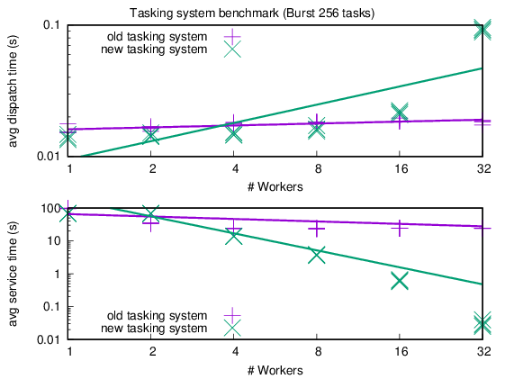

<!-- more -->
Pulp is about to introduce a new replacement for its tasking system.
This complete redesign comes with a much simpler architecture that will drop the need for the
resource-manager, the last singleton in the Pulp 3 infrastructure.
Additionally, the distributed nature of the new task worker type drops the use of `Redis Queue`
(`rq`).
With this simplification there is no longer a need to replicate task data accross two databases.
The main Postgres Pulp database will therefore be the single source of truth about tasks.
Last but not least, the new worker type will use Postgres advisory locks to ensure exclusive access
to tasks.
This is a much more lightweight approach than storing access locks in a separate table.
Also it simplifies the cleanup process vastly if a worker dies as postgres will clean the locks
with its connection.

Benefits and Performance
------------------------

With all these simplifications, the new tasking system is more reliable.
Without the resource-manager as the single point of failure, it will be fully high available.
Also with the resource-manager seen as the choke point in task processing, the new distributed
system will scale much better in performance with the number of parallel running workers.

<figure markdown="span">
  
  <figcaption>Tasking system benchmark</figcaption>
</figure>

> This image shows the benchmark of the old and new tasking system with a single thread bursting
  256 tasks that need a random 2 out of a pool of 128 abstract resources and need 0.5 s to
  complete.
  In the first panel, the average time the foreground thread needs per task is plotted, and in the
  second, the average time a task needs from being available in the system to when it's picked up
  by a worker.
  It can be seen in the old system that the `resource-manager` is able to deliver about 2 tasks per
  second, and that providing more than two workers does not yield additional speedup.
  In the new tasking system however the task throughput scales up with the number of workers
  provided.
  However starting with 32 workers, the database load of concurrent processes polling the tasks
  table will slow down the insertion of new tasks into the system by a factor of about 5.

The removal of the queueing system brings another nontrivial benefit to the table.
Tasks are no longer assigned to workers before actually starting, and therefore no tasks will be
canceled that are already pending in the task queue on a worker restart.

Deploying the new Tasking System
--------------------------------

This new system will be introduced in the upcoming 3.14 release of Pulpcore as a drop in
replacement and activated by default.
If you want to stay with the traditional tasking system for longer, we advise that prior to
upgrading, you set the `USE_NEW_WORKER_TYPE` setting to `False`.
That is adding `use_new_worker_type: false` to `pulp_settings` if you use the Ansible pulp
installer.
To activate the new system later, you just need to set the `USE_NEW_WORKER_TYPE` setting to `True`
and restart your Pulp services.
If you decide to go back, it is basically the same process, where you flip the setting to `False`.
For production environments, however, we recommend that you first drain your task queues by
shutting down the api-workers first.
While this process introduces a downtime on the api side, the content delivery side is not affected
by this change and does not necessarily need to be restarted.
The current plan is to deprecate the old tasking system, to be removed one or two minor releases
later.

A note for integrators:
  While this infers that Redis can eventually be dropped from Pulp's architecture, it is likely to
  be reintroduced again soon for caching access on the content delivery side.
