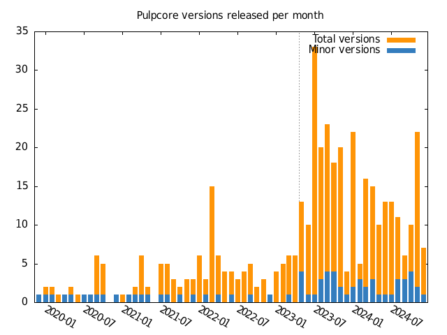

"Release fast, release often!" is not a metaphor, it is a mantra.

Pulp used to be a service mainly running on-premises as part of products with extremely long release cycles.
About two years ago, we heard rumors to add highly volatile cloud service style installations to the mix.
Because releasing a new version of pulpcore or any of its many plugins was a herculean task, the rumors were accompanied by very concerning sentences like:
_"We will run this service off of main branches of all the plugins."_
If that does not make you shiver, you can just stop reading here and go on with your happy life.

<!-- more -->

So I started to realize the only way we can both serve the fast and volatile cloud service world as well as the established slow longterm stable on premises product world is to be able to release whatever component of pulp within the blink of an eye.

Back on 2022 Dec 7th I wrote down these lines (verbatim) in a simple file as a conversation starter.

```
# Continuous Delivery for Pulp

We want to deliver pulp continuously:
- Deploy from `main` branch(es).
- Release whatever whenever.
  - All main branches must be ready to release at all times.
  - Git dependencies and dependencies on pre-release versions should fail a ready-to-ship check and prevent merging.

We need to get rid of "Required-PR". You can install with pip from a git branch.
Plugins need to depend on released versions of Pulpcore.
When a plugin needs a core feature, make a release. (Don't make a fuzz about it. Is releasing every tuesday too much?)
```

And I started having conversations, first small, then with increasing audience.
Until one day I decided the idea was ripe to be presented at the Pulp team all hands meeting.
A big shoutout to my peers there. They were just about the right amount of wary.
They asked exactly the right questions and let me shatter a fair amount of unspoken but gridlocked assumptions.
Fast forward to now, they have fully adopted the idea and actively supported the effort to ultimate success.

But to set the stage right, we didn't start from nothing.
Our project ecosystem already had the so called plugin template, that helps us to keep all the CI/CD infrastructure in a dozen git repositories in sync.
Also a huge amount of work has been done to turn the manual half a day per version release process into a completely automated one.

So standing on the shoulders of these giants, we needed to adjust the following things:

- Pull requests against plugins must be developed against the last released version of pulpcore, as you would do with any other library.
    - Not only do we not use the main branch of pulpcore in a plugin's CI anymore, but also stopped using the `Required-PR` feature that, for the benefit to run against uncommitted changes, required fragile coordination of merges spanning multiple repositories.
    - In fact, this policy forces us to better coordinate the deprecation schedules for breaking changes and make sure other changes are additive in nature.
- Since `pulp_file` and `pulp_certguard` are poster children for `pulpcore` tests having a circular test dependency, these three components were merged into a single repository.
- All tests must be run on pull requests (for code changes) and nightly on main (for unexpected changes in the environment).
    - Performance tests are the exception here, because developer experience is very important too.
- The criterion for inclusion in the main branch must be "shippable". No dependencies on unreleased code are allowed. The pull request review therefore is the last gate to inclusion in the next release.
- The test workflow should contain as much of the release process as possible up to but not including the point where packages are uploaded to PyPi / Rubygems.
- The actual release process should contain only the steps necessary to build and publish the final packages.
    - i.e. there's no need to repeat running the tests, because the code passed that gate already.
- The release of a version should be fully automated to the end from the click of a button.
    - Since there is no way to test the release process, running it more often (creating more releases) is better.
- We needed to adjust our deprecation policy slightly (from 5 releases to 15 between breaking changes).
- The results of the nightlies must be made aware to the team. Being red must lead to an all hands on deck call.

The most astonishing side effect in all of this is, when we realized, we stopped spending about six engineer hours per week in a crowded meeting on discussing whether performing the next release is worth doing or we should delay once more.
We now simply release a new Y-release of Pulpcore every Tuesday given a feature is pending in main, and a Z-release on all the supported branches that received any backports or dependency updates.
We can also release a new bugfix release at any time if asked to do so.
Another sign of the team fully supporting the idea is the prompt contribution of a `check_release` script to replace the manual examination of these conditions.
We even automated preparing a new release branch (y-stream) and managing the patchback-labels for supported branches.

For plugins we deliberately did not impose these rules as they all have their respective maintainer.
However, they all receive the automating facilities via the plugin template.

We picked up the new release cadence in May 2023 with the pulpcore 3.25.0 release.
The frequency of y-releases increased instantaneously from about one in two to three months to roughly two per month (not every week a new feature release was necessary).
Also we still allow ourselves to delay a breaking change release (recurring every 15 y-releases) by a couple of weeks for carefully selected release blockers.



Nothing comes for free though.
The fact that we produce so many y-Releases now made it an absolute necessity to reduce the number of supported release branches.
But we managed to negotiate with our downstream products that we keep a small set of them alive for their lifetime in a supported product.
i.e. we keep these branches up to date with the plugin template and allow backporting bugfixes.
When the stars are properly alinged this allows us to get a security bugfix released on an old branch in twenty minutes.
The branches in between are simply abandoned.

Once again I want to express a heartfelt thank you to my team, including management, and end with reciting two very reassuring, quoteworthy and related phases I came accross on the way:

*Quote from [Opensource Security Podcast](https://opensourcesecurity.io/2024/03/17/episode-420-whats-going-on-at-nvd/):*
> I don't care about vulnerability management for as much as for example your ability to ship an update.
  Like if you can't ship an update no amount of vulnerability management matters." (00:31:29)

*Quote from Grant Gainey (in a private message):*
> If we want to release early, often, automatically, and reliably - and especially if we want to be responsive to things like "prod services are down we need this fix ASAP to restart them" - then every minute we spend on making the CI better, is going to be repaid.
```


### References:

- <https://discourse.pulpproject.org/t/need-to-reduce-the-number-of-release-branches-aka-we-need-an-lts-strategy/449>
- <https://discourse.pulpproject.org/t/switching-pulpcore-to-calendar-versioning-scheme/771>
- <https://discourse.pulpproject.org/t/pulpcore-3-25-is-on-the-horizon-and-upcoming-changes-in-release-cadence/840>
- <https://discourse.pulpproject.org/t/discussion-pulp-release-process-improvements/860>
